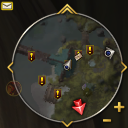
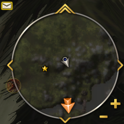
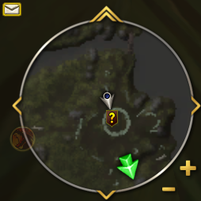
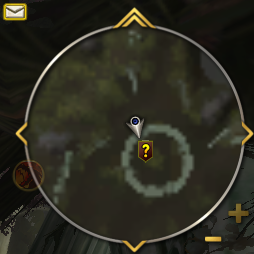

# Questie Retail Minimap Navigation

A retail-style quest navigation arrow for the **3.3.5a (Wrath of the Lich King)** minimap — a
plugin built for the **[DragonUI](https://github.com/NeticSoul/DragonUI)** minimap that takes
its quest data from **[Questie-335](https://github.com/Aldori15/Questie)**.

The addon draws a single arrow at the edge of the minimap that points at the nearest quest
objective (or turn-in) of your tracked quests, and tints it from red (far) to green (near), the
way modern retail clients do.

---

## Requirements

| | |
|---|---|
| Client | World of Warcraft **3.3.5a** (Interface `30300`) |
| Required | **Questie-335** — the data source (`RequiredDeps` + `LoadWith`) |
| Optional | **DragonUI** — the minimap this addon is built and styled for (`OptionalDeps`) |
| Files | `QuestieRetailMinimapNav.lua`, `arrow_body.tga`, `arrow_gloss.tga` |

Questie is a hard dependency: the addon loads with Questie (`## LoadWith: Questie-335`) and uses
its map, zone, tracker and phasing modules plus its bundled `HereBeDragonsQuestie-2.0` library.

DragonUI is optional. The arrow is positioned against the minimap frame, so it also works with
the default minimap, but its default radius, size and artwork are tuned to DragonUI's minimap.

## Installation

1. Copy the `QuestieRetailMinimapNav` folder into
   `World of Warcraft/Interface/AddOns/`.
2. Make sure `Questie-335` is installed in the same `AddOns` folder.
3. Restart the client (or `/reload`).

> **Installing from a GitHub ZIP download:** the extracted folder is named
> `QuestieRetailMinimapNav-main`. Rename it to `QuestieRetailMinimapNav`, otherwise the
> client will not load the addon (the folder name must match the `.toc` file name).

---

## Screenshots

All panels below are the same 254×254 crop of the minimap, centred on the minimap ring.

| Far away | Getting closer | Almost there | Arrived — no arrow |
|---|---|---|---|
|  |  |  |  |

**The arrow's colour is the distance to the objective** — an idea we took from TomTom's arrow
and credit to it: green means you are close, red means you are far. That is all that came from
TomTom; the gradient maths, the tinting and the placement here are our own. The tint runs along
a red → yellow → green gradient — fully red at 250+ yards, yellow around halfway, fully green
within 30 yards.

**The last panel is the arrival state — the arrow is gone.** Instead of jittering around the
middle of the minimap once you are practically standing on the target, the arrow hides as
soon as you are close enough:

- a **point** objective (an NPC, an object, a turn-in) hides the arrow within **15 yards**;
- an **area** objective hides it as soon as you step **inside the area** — the area radius is
  the distance from the spawns' centre to their furthest visible spawn, capped at 100 yards so
  that widely scattered spawns cannot hide the arrow across a whole zone.

The arrow also stays hidden while there is no tracked objective, while the minimap itself is
hidden (world map open, battlegrounds…), or while the current objective is in another instance.

---

## Features

- **Automatic target selection** — every 0.5 s all tracked quests are scanned and the closest
  objective is chosen. If a quest is complete, the arrow points at the turn-in NPC instead.
- **Area-aware navigation** — for objectives with many scattered spawns the arrow points at the
  **centroid** of the visible spawns instead of the nearest single spawn, which stops the arrow
  from spinning as you move.
- **Distance color gradient** — fully green within 30 yards, fully red beyond 250 yards, a
  yellow blend in between (the idea of colouring the arrow by distance comes from TomTom's
  arrow; the implementation is ours).
- **Rotating minimap support** — the delta vector is rotated by the player's facing when
  `rotateMinimap` is enabled, using the same math as Questie's own minimap pins.
- **Arrival hiding** — the arrow disappears within 15 yards of a point objective, or as soon as
  you step inside the area of an area objective (capped at 100 yards radius), so it never
  jitters on top of the minimap center.
- **Zone-transition grace** — when the player's world position is momentarily unavailable
  (loading screen / zone change) the arrow stays frozen in place for 1 second instead of
  flickering.
- **Hover tooltip** — hovering the arrow shows the quest name. If a native minimap tooltip is
  already under the cursor, the quest name is merged into that tooltip with a matching font,
  otherwise a standalone tooltip is shown. The arrow itself is mouse-transparent, so it never
  blocks native minimap tooltips or POI markers.
- **Built for DragonUI** — the arrow is parented to `UIParent` (not `Minimap`) and drawn on the
  `TOOLTIP` strata, so DragonUI's minimap decorations and clipping do not hide it, and native
  minimap tooltips still work underneath it.

---

## Slash commands

Tune the arrow live in-game; values are saved to `QRNNavDB`.

| Command | Description |
|---|---|
| `/qrn` | Print the current `radiusScale` and `size` values |
| `/qrn radius <n>` | How far from the minimap center the arrow sits (`1.0` = on the edge, `0.5` = halfway) |
| `/qrn size <n>` | Arrow width and height in pixels |
| `/qrn reset` | Restore the default values |

`/qrn r <n>` and `/qrn s <n>` are accepted as shortcuts.

**Defaults:** `radiusScale = 0.75`, `size = 64`.

---

## Configuration constants

These are defined at the top of [QuestieRetailMinimapNav.lua](./QuestieRetailMinimapNav.lua)
and require editing the file.

| Constant | Default | Meaning |
|---|---|---|
| `TARGET_INTERVAL` | `0.5` | Seconds between nearest-objective scans |
| `ARROW_INTERVAL` | `0.05` | Seconds between arrow position updates |
| `TOOLTIP_INTERVAL` | `0.1` | Seconds between hover-tooltip updates |
| `POSITION_GRACE` | `1.0` | Seconds the arrow is frozen when the player position is unavailable |
| `ARRIVAL_DISTANCE` | `15` | Yards; arrow hides inside this radius |
| `MAX_AREA_RADIUS` | `100` | Yards; upper bound for an area objective's hide radius |
| `COLOR_NEAR` | `30` | Yards; fully green at or below this distance |
| `COLOR_FAR` | `250` | Yards; fully red at or above this distance |

---

## How it works

1. Questie's `TrackerUtils:GetSortedQuestIds()` provides the tracked quests, and
   `QuestieMap` / `ZoneDB` / `Phasing` resolve their objectives and spawns.
2. Every spawn is converted to world coordinates via `HBD:GetWorldCoordinatesFromZone`, spawns
   from other instances and non-visible phases are discarded.
3. For each objective a centroid and its extent radius are computed; the closest candidate to
   the player wins. Point objectives (turn-ins, dungeon entrances) fall back to a single nearest
   spawn.
4. Each frame the arrow is placed at a fixed inset from the minimap center along the normalized
   direction to the target, and both its body and gloss textures are rotated toward it.
5. The body texture is tinted with the distance gradient; the gloss layer always stays white.

## Saved variables

`QRNNavDB` — a table storing `radiusScale` and `size` between sessions.

## Troubleshooting

- **The arrow never appears** — verify that `Questie-335` is installed and enabled; the addon
  aborts silently if Questie's modules cannot be imported.
- **The arrow points at nothing useful** — make sure the quest you want is tracked in the Questie
  tracker; only tracked quests are considered.
- **Arrow position or size feels off** — adjust it with `/qrn radius <n>` and `/qrn size <n>`
  instead of editing the file, then `/qrn reset` to go back.

## Files

| File | Purpose |
|---|---|
| `QuestieRetailMinimapNav.lua` | All addon logic |
| `QuestieRetailMinimapNav.toc` | Addon metadata and load order |
| `arrow_body.tga` | Grayscale arrow body, tinted by the distance gradient (Blizzard artwork — see below) |
| `arrow_gloss.tga` | Untinted white highlight/gloss overlay (Blizzard artwork — see below) |
| `LICENSE` | MIT License — covers the code and the documentation |
| `NOTICE` | What the MIT License does *not* cover (the arrow textures and screenshots) |
| `LICENSES/DragonUI-MIT.txt` | DragonUI's MIT notice, reproduced to satisfy its attribution condition |
| `THIRD_PARTY_NOTICES.md` | Attribution: the arrow artwork, DragonUI, Questie, TomTom |
| `screenshots/` | The README preview images above (in-game imagery © Blizzard Entertainment) |

## License

The addon's **code and documentation** are released under the
[MIT License](./LICENSE), © 2026 Acolit-sys.

That license does **not** cover the two arrow textures or the screenshots: those are our rework
of `poi-corpse.tga` from DragonUI, which is World of Warcraft user-interface artwork —
© Blizzard Entertainment, Inc. We cannot license artwork that belongs to Blizzard, so we claim
no rights over it and ship it only so the addon can draw its arrow inside the game. The exact
scope is spelled out in [NOTICE](./NOTICE), with full attribution in
[THIRD_PARTY_NOTICES.md](./THIRD_PARTY_NOTICES.md).

Questie is a hard dependency and is **not** bundled — no Questie code, data or assets are
redistributed here; users install Questie separately under its own license.

## Credits

- **DragonUI** — the minimap this addon is built for, and the addon we took the arrow texture
  from (`poi-corpse.tga`). Its MIT notice is reproduced in
  [`LICENSES/DragonUI-MIT.txt`](./LICENSES/DragonUI-MIT.txt).
- **Questie / Questie-335** — our data source: the quest log, objectives, spawn coordinates, zone
  mapping, phasing and the `HereBeDragons` APIs this addon drives.
- **TomTom** — the idea of colouring the arrow by distance. Nothing but the idea was taken.
- **Blizzard Entertainment** — the original World of Warcraft minimap artwork.

This is a free, fan-made addon and is not affiliated with or endorsed by Blizzard
Entertainment, Questie, TomTom, or DragonUI.

## Version

`1.1.0` — see the `## Version` field in
[QuestieRetailMinimapNav.toc](./QuestieRetailMinimapNav.toc).
